# Signup, Login Into React Native Apps using graphQL, react-apollo with Facebook or Google Logging

## Backend
### Now, let’s set up the backend that handles signup, login using graphQL with mLab database and user authentication via Facebook and Google OAuth apps that we created in the previous steps.

#### These are the tools that we’re going to use:
*	Node.js. A platform that allows JavaScript to be used outside the Web Browsers, for creating web and network applications.
*	Express. Node.js web application framework.
*	Passport. An authentication middleware for Node.js.
*	Passport-Facebook. Facebook authentication strategy for Passport and Node.js.
*	Passport-Google-OAuth20. Google (OAuth 2.0) authentication strategy for Passport.
*	graphql-tools- graphql-tools package are not just useful for building servers. They can also be used in the browser, for example to mock a backend during development or testing
*	express-graphql- The express-graphql module provides a simple way to create an Express server that runs a GraphQL API.
*	Mongoose- Mongoose is a MongoDB object modeling tool designed to work in an asynchronous environment.

#### Initialize Node.js Project
*	Create a new folder called backend:
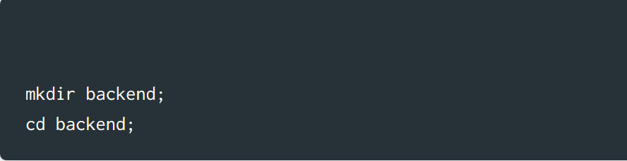
Run npm init to create the package.json file, so we can install backend dependencies separately from React Native app:
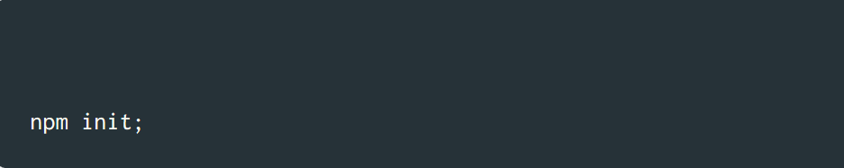
It’s going to ask you a few questions. You can just press return to give the default answers for each question.

*	Install Dependencies
First, install dev dependencies that we’ll going to need during development:
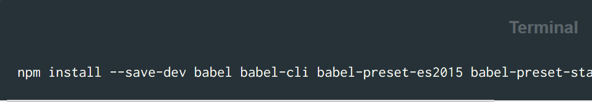
And next, install the dependencies that we’ll use to do some work:
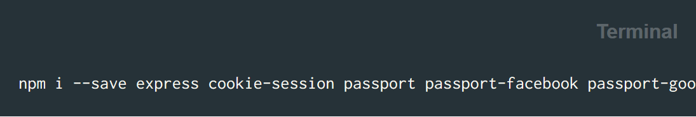

*	Create the Database in mLab
Login in mlab and create new 

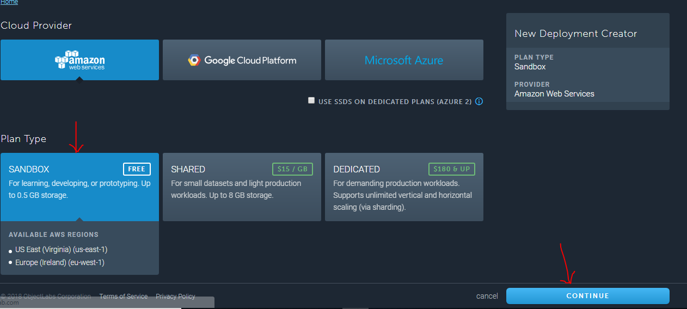
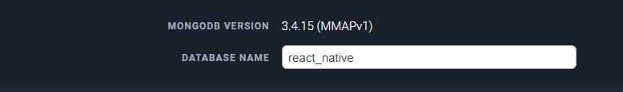
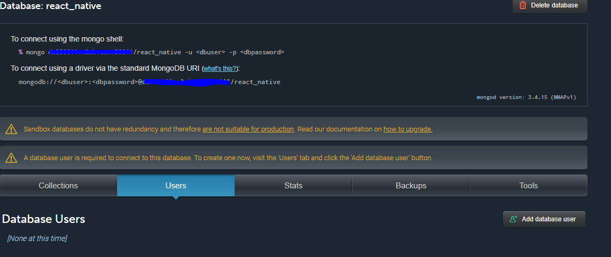

*	Create User model

```
const userSchema = new Schema({
      email: String,
      password: String,
 
      id: String,
      token: String,
      name: String
});

module.exports = mongoose.model('User',userSchema);

```
*	Create Schema user 
```
type User {
  _id: String!
  email: String!
  password: String!
}

type Mutation {
  createUser(email: String!, password: String!): User!
  login(email: String!, password: String!): String!
}


```
*	Create resolver 
```
Mutation: {
  createUser: async (parent, args, { User }) => {
  const userargs = args;
 
    const existingUser = await User.findOne({ email:userargs.email });
     if (existingUser) {
       throw new Error('Email already used');
     }
    userargs.password = await bcrypt.hash(userargs.password, 12);
    return User.create(userargs);
  },
  
  login: async(parent, { email, password }, { User, SECRET }) => {
    const userch = await User.findOne({ email });
      if (!userch){
        throw new Error('Not user with that email');
      }
      const valid = await bcrypt.compare(password, userch.password);
      if(!valid){
        throw new Error('Incorrect password');
      }
      const token = jwt.sign(
      {
        userch: _.pick(userch, ['id', 'username']),
      },
      SECRET,
      {
          expiresIn: '1y',
      }
    );
      return token;
  },

},

```
*	Create the Server
Let’s create a script that will run an HTTP server and handle incoming requests
•	Create a new file called server.js with the following content
```
// import required packages
const typeDefs  = require('./schema/schema');
const resolvers = require('./schema/resolver');
const User = require('./model/users');

// mlab database connection
mongoose.connect(‘MondoDB_URI’); 
mongoose.connection.once('open', () =>{
  console.log("connected to database");
});
const schema = makeExecutableSchema({
  typeDefs,
  resolvers
});

const SECRET = 'secret string put here';

// Transform Facebook profile because Facebook and Google profile objects look different
// and we want to transform them into user objects that have the same set of attributes

// Transform Google profile into user object

// Here Register Facebook Passport strategy

// Here Register Google Passport strategy

// Serialize user into the sessions
passport.serializeUser((user, done) => done(null, user));

// Deserialize user from the sessions
passport.deserializeUser((user, done) => done(null, user));

// Initialize http server
const app = express();

// Initialize Passport
app.use(passport.initialize());
app.use(passport.session());

// Set up Facebook auth routes(call facebook API)

// Set up Google auth routes(call Google API)

app.use('/graphql', bodyParser.json(), graphqlExpress({ schema, context: { User, SECRET } }));
app.use('/graphiql', graphiqlExpress({ endpointURL: '/graphql' }));

const server = app.listen(4000, () => {
  const { address, port } = server.address();
  console.log(`Listening at http://${address}:${port}`);
});
```
*	Launch the Server

Let’s launch the server and see how it works.

•	Open Terminal App and execute:
```
nodemon
```
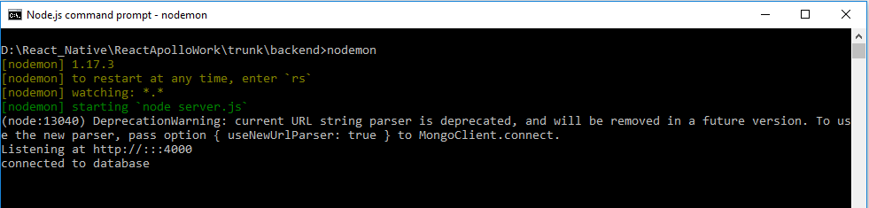
That means the server works. That’s great. Keep it running and let’s continue to the mobile app.

## Mobile App
### Now that we have our backend ready let’s build the mobile app with react-apollo.
#### react-apollo -React-Apollo includes a component for providing a client instance to a React component tree, and a higher-order component for retrieving that client instance.
*	Generate project using react-native cli:
```
react-native init OAuthLogin npm install 
```
It will create project structure.
*	Link backend to react native front end using apollo-client-preset(HttpLink)
```
const client = new ApolloClient({
  link: new HttpLink({ uri: 'http://localhost:4000/graphql' }),
  cache: new InMemoryCache()
});
```
*	The ApolloProvider is similar to React’s context provider. It wraps your React app and places the client on the context, which allows you to access it from anywhere in your component tree.
```
<ApolloProvider client={client}>
    <Routes/>
</ApolloProvider>
```
*	Signup
```
onAuth(){
    if(this.props.type == 'Signup'){
       this.props.createUser(this.state.email,this.state.password).then(() =>{
            Actions.login();
       })
       .catch(() => {
            alert("Unsuccessful..Check connection or email already used");
       });
    }
	}
```
Mutation-
```
const signupMutation = gql`
   mutation ($email: String!, $password: String!) {
     createUser(email: $email, password: $password) {
       email
       password
     }
   }`


graphql(signupMutation, { props: ({ mutate }) => ({
  createUser: (email, password) => mutate({ variables: { email, password } }),
  })
}),
```
Result –

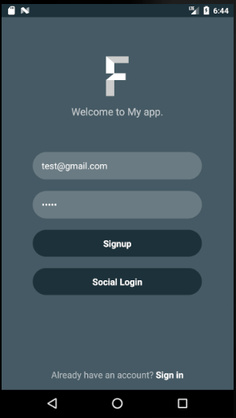
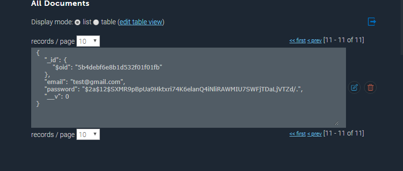

*	Login
```
onAuth(){
      this.props.login(this.state.email,this.state.password).then(() =>{
           Actions.home();
        })
        .catch(() => {
            alert("Unsuccessful Login..try again");
        })

    }
}
```

Mutation-

```
const loginMutation = gql`
   mutation ($email: String!, $password: String!) {
     login(email: $email, password: $password)
  }`


graphql(loginMutation, { props: ({ mutate }) => ({
   login: (email, password) => mutate({ variables: { email, password } }),
   })
 })
 
```

Result –

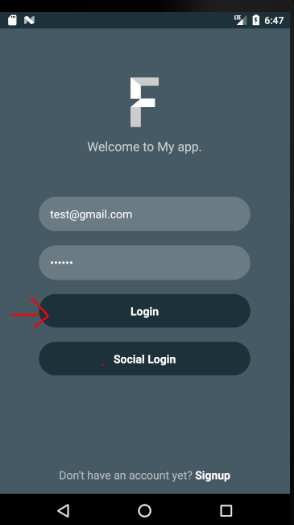
If credentials not match it will throw error like below-
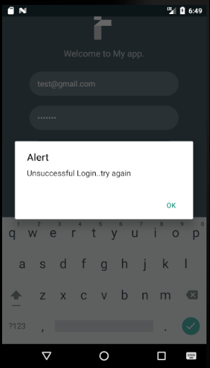
For successful login –
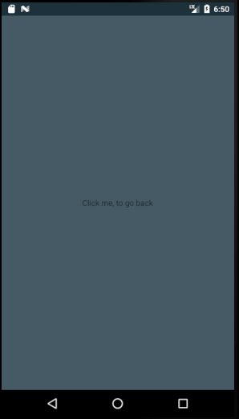

*	Facebook login 
```

loginWithFacebook = () => this.openURL('https://localhost:4000/auth/facebook');

```

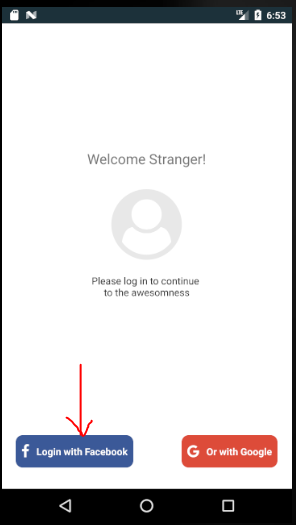
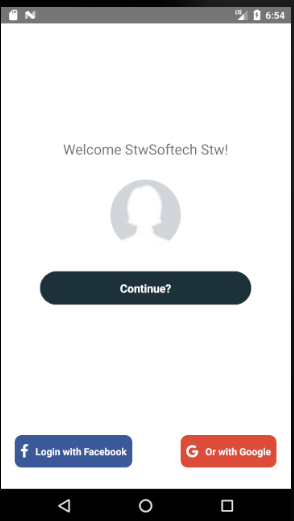
*	Google+ login

```
loginWithGoogle = () => this.openURL('https://localhost.xip.io:4000/auth/google');

```

It will directly call api from server/backend

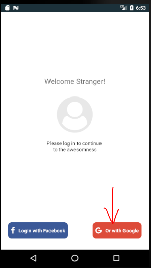
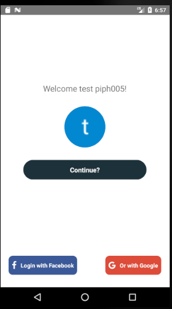

## Facebook Login
### We’re going to build an app that users can log into with their Facebook or Google account. Actually, we’re going to build two things:

*	Node.js backend. It’s going to handle user authentication via Facebook and Google OAuth and redirect the user back to the mobile app using a special URL that will look like OAuthLogin://login?user=...
*	React Native mobile app. It’s going to show login buttons and once clicked send the user to the backend to have them log in with their Facebook or Google accounts
That’s how it’s going to look like.
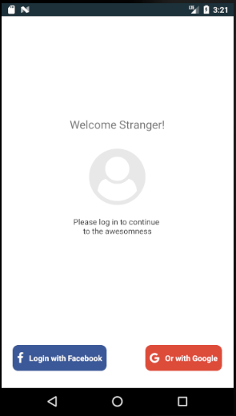

#### Setting Up Facebook App
*	Go to https://developers.facebook.com/.
*	Click My Apps and then Add a New App(It will create App ID with App secret)

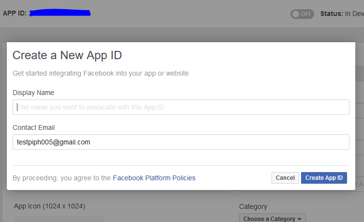

*	Don’t forget to add Email id in Facebook account. 
*	Add platform

Settings ->Basics -> Add platform -> Web

	Set Url , 
	
	e.g https://localhost:4000/auth/facebook/callback
	
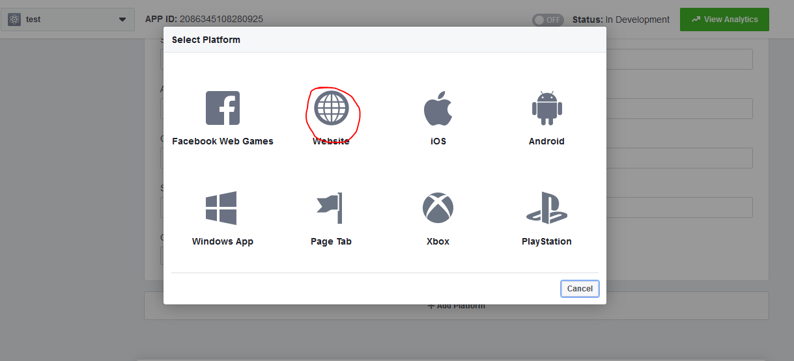

*	App Domains(optional)

o	Same as above url - https://localhost:4000/auth/facebook/callback 

*	Privacy Policy URL(optional)	

o	Create policy url here - https://www.freeprivacypolicy.com/

o	After creating policy save that policy with html extension and placed it to Google drive

o	Get sharable link of that file using Right click->Get sharable link from Google drive

o	Place that link to Privacy Policy URL

*	On status 

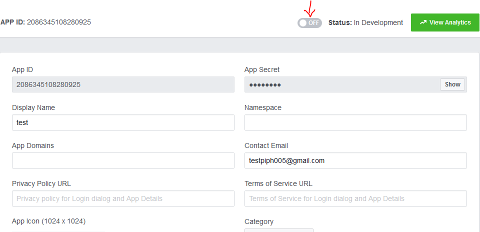
*	Add Valid OAuth Redirect URIs  in Facebook Login option(Same as App domain .It is mandatory)

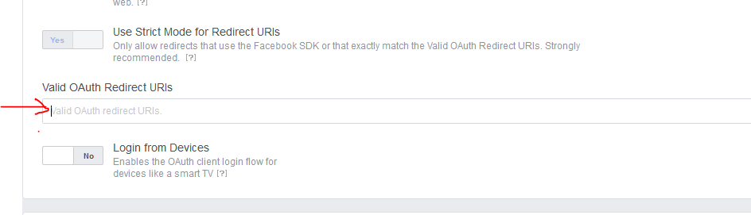

*	Save all changes
*	Add API in server
```
passport.use(new FacebookStrategy(
    {
        clientID:’’,
        clientSecret:’’,
        callbackURL: 'https://localhost:4000/auth/facebook/callback',
        profileFields: ['id', 'name', 'displayName', 'picture', 'email'],
    },
  // Gets called when user authorizes access to their profile
  function (accessToken, refreshToken, profile, done){
    // Return done callback and pass transformed user object
     done(null, transformFacebookProfile(profile._json))
     }
));

app.get('/auth/facebook', passport.authenticate('facebook'));

app.get('/auth/facebook/callback',
  passport.authenticate('facebook', { failureRedirect: '/auth/facebook' }),
  // Redirect user back to the mobile app using Linking with a custom protocol OAuthLogin
  (req, res) => res.redirect('app_name://login?user=' + JSON.stringify(req.user)));
  
```
	


